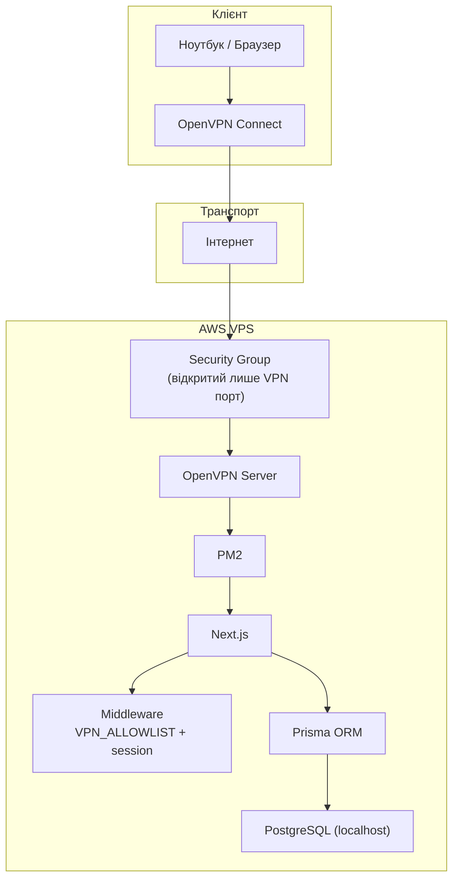
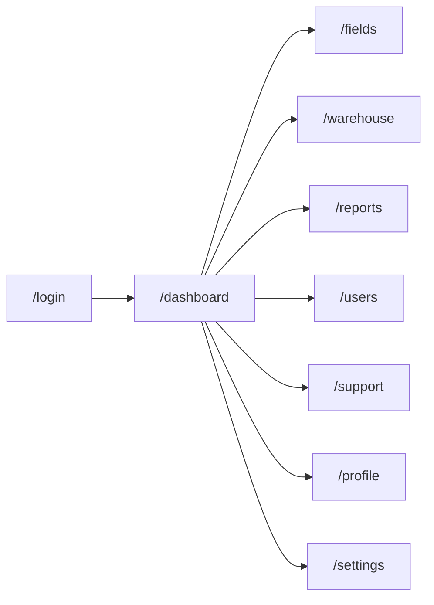
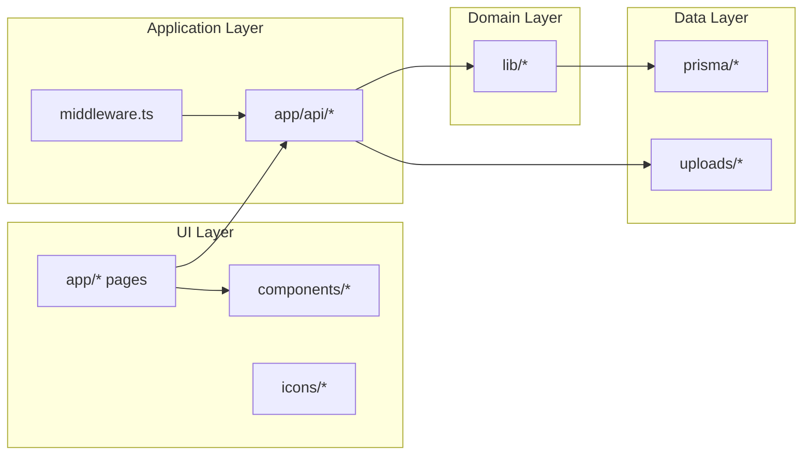

# AgroPlus Portal

> Це мій внутрішній операційний портал для агробізнесу. Він працює тільки через OpenVPN, а база даних живе на самому сервері. Без зовнішніх хмар.

## Зміст

- [Візія проєкту](#візія-проєкту)
- [Модулі системи](#модулі-системи)
- [Архітектура](#архітектура)
- [Шлях запиту: 5 етапів](#шлях-запиту-5-етапів)
- [Ешелонований захист](#ешелонований-захист)
- [Карта сторінок](#карта-сторінок)
- [Технологічний стек](#технологічний-стек)
- [Локальний запуск](#локальний-запуск)
- [Деплой на сервер (PM2)](#деплой-на-сервер-pm2)
- [OpenVPN і доступ](#openvpn-і-доступ)
- [Структура проєкту](#структура-проєкту)
- [Скрипти](#скрипти)
- [Безпека](#безпека)

## Візія проєкту

Цей проєкт я побудував як єдину робочу систему для операційної команди:

- Поля: карта, геометрія, задачі, статуси.
- Склад: облік, списання, історія руху.
- Звіти: upload `PDF/XLSX`, імпорт даних, привʼязка до користувача.
- Користувачі: ролі, активність, профіль і налаштування.
- Підтримка: тікети, пріоритети, вкладення.
- Сповіщення: системні події в реальному робочому потоці.

## Модулі системи

| Модуль | Як працює | Сутності |
|---|---|---|
| `Dashboard` | KPI, погода, паливо, курси, прогнози | `YieldForecast`, `Machinery`, `Notification` |
| `Fields` | Інтерактивна карта та задачі по полях | `Field`, `FieldTask` |
| `Warehouse` | Складські позиції, історія, списання | `InventoryItem`, `InventoryLog` |
| `Reports` | Завантаження, парсинг XLSX, зберігання файлів на сервері | `Report`, локальне сховище |
| `Users` | Користувачі, ролі, активність | `User` |
| `Support` | Тікети, пріоритети, вкладення | `SupportTicket`, `SupportAttachment` |
| `Profile / Settings` | Персональні параметри користувача | `User.profileData`, `User.settingsData` |

## Архітектура



## Шлях запиту: 5 етапів

### Етап 1. Ініціація (мій ноутбук)

Я відкриваю браузер і йду на внутрішню адресу сервера. Це адреса з приватної AWS‑мережі, вона не існує в звичайному інтернеті. OpenVPN Connect бере HTTP‑запит і шифрує його, після чого відправляє на публічний IP сервера через VPN‑порт.

### Етап 2. Прохідна (AWS)

Security Group пропускає тільки VPN‑трафік. OpenVPN Server розшифровує пакет і бачить оригінальний запит до `localhost:3000`.

### Етап 3. Веб‑додаток (Next.js + PM2)

PM2 тримає сайт активним. Next.js приймає запит, перевіряє сесію і `VPN_ALLOWLIST`. Якщо все ок — рендерить сторінку.

### Етап 4. Дані (Prisma + PostgreSQL)

Prisma переводить запит з TypeScript у SQL. PostgreSQL працює тільки на `localhost` і не відкритий назовні. Дані читаються з диску сервера і повертаються назад у застосунок.

### Етап 5. Відповідь

Next.js формує HTML, OpenVPN шифрує відповідь, і на моєму ноутбуці зʼявляється сторінка.

## Ешелонований захист

Я використовую defense‑in‑depth на трьох рівнях:

1. Мережевий рівень: порт сайту і БД не доступні з інтернету, тільки через VPN.
2. Транспортний рівень: весь трафік зашифрований.
3. Прикладний рівень: middleware перевіряє сесію та VPN‑allowlist.

База локальна, не залежить від зовнішніх хмар, дані повністю під контролем компанії.

## Карта сторінок



## Технологічний стек

| Шар | Технології |
|---|---|
| UI | `Next.js 15`, `React 19`, `Tailwind CSS`, `MapLibre`, `Recharts` |
| Backend | `Next.js Route Handlers`, `Prisma` |
| Data | `PostgreSQL (local)`, файлове сховище на сервері |
| Process | `PM2` |
| Network | `OpenVPN` |
| QA | `Vitest`, `Playwright` |

## Локальний запуск

Я використовую такий цикл:

1. Встановлюю залежності.
```bash
pnpm install
```

2. Створюю `.env` із шаблону.
```bash
cp .env.example .env
```

3. Заповнюю ключові змінні: `DATABASE_URL`, `DIRECT_URL`, `AUTH_SECRET`, `VPN_ALLOWLIST`.

4. Синхронізую схему з БД.
```bash
pnpm db:push
```

5. За потреби заливаю демо‑дані.
```bash
pnpm db:seed
```

6. Підіймаю застосунок.
```bash
pnpm dev
```

## Деплой на сервер (PM2)

Мій продакшен‑цикл виглядає так:

```bash
pnpm install --frozen-lockfile
pnpm prisma migrate deploy
pnpm build
pm2 start npm --name agroplus -- start -- -p 3000 -H 0.0.0.0
pm2 save
```

## OpenVPN і доступ

- VPN працює як єдиний канал доступу до сайту.
- Вхідний трафік у Security Group відкритий лише для VPN‑порту.
- База слухає тільки `localhost` і недоступна з інтернету.

Приклад `VPN_ALLOWLIST`:

```env
VPN_ALLOWLIST="10.8.0.0/24,203.0.113.10/32"
```

## Структура проєкту

### Архітектурна карта директорій



### Дерево і роль кожної частини

```text
.
├── app/                         # сторінки, layout, route handlers
│   ├── api/                     # backend endpoints
│   ├── dashboard/               # оперативна панель
│   ├── fields/                  # карта полів і задачі
│   ├── warehouse/               # склад і рух залишків
│   ├── reports/                 # звіти і upload UI
│   ├── users/                   # користувачі та ролі
│   ├── support/                 # тікети підтримки
│   ├── profile/                 # профіль
│   └── settings/                # налаштування
├── components/
│   ├── ui/                      # універсальні UI-компоненти
│   └── branding/                # бренд-елементи
├── icons/                       # іконки проєкту
├── lib/                         # доменна логіка, auth, db, утиліти
├── prisma/
│   ├── schema.prisma            # модель даних
│   └── seed.ts                  # стартові дані
├── scripts/                     # технічні скрипти
├── tests/
│   ├── unit/                    # unit тести
│   └── e2e/                     # end-to-end тести
├── uploads/                     # локальні завантаження/файли звітів
├── middleware.ts                # контроль доступу (session + VPN allowlist)
└── README.md                    # документація проєкту
```

### Де я додаю новий функціонал

| Що додаю | Куди додаю |
|---|---|
| Нова сторінка | `app/<feature>/page.tsx` |
| Новий API endpoint | `app/api/<feature>/route.ts` |
| Нова бізнес‑логіка | `lib/<feature>.ts` |
| Нова таблиця / звʼязок | `prisma/schema.prisma` + міграція |
| Нові UI‑примітиви | `components/ui/*` |
| Новий e2e сценарій | `tests/e2e/*` |
| Новий unit‑тест | `tests/unit/*` |

## Скрипти

- `pnpm dev` - локальна розробка
- `pnpm build` - production build
- `pnpm start` - запуск production
- `pnpm lint` - перевірка ESLint
- `pnpm prisma` - Prisma CLI
- `pnpm db:push` - синхронізація схеми без міграцій
- `pnpm db:seed` - початкові демо‑дані
- `pnpm test:unit` - unit‑тести
- `pnpm test:e2e` - e2e‑тести
- `pnpm test` - повний прогін тестів

## Безпека

- `.env` не потрапляє в Git.
- База даних ізольована на `localhost`.
- VPN — єдиний публічний вхід у систему.
- Middleware перевіряє сесії та дозволені IP.
