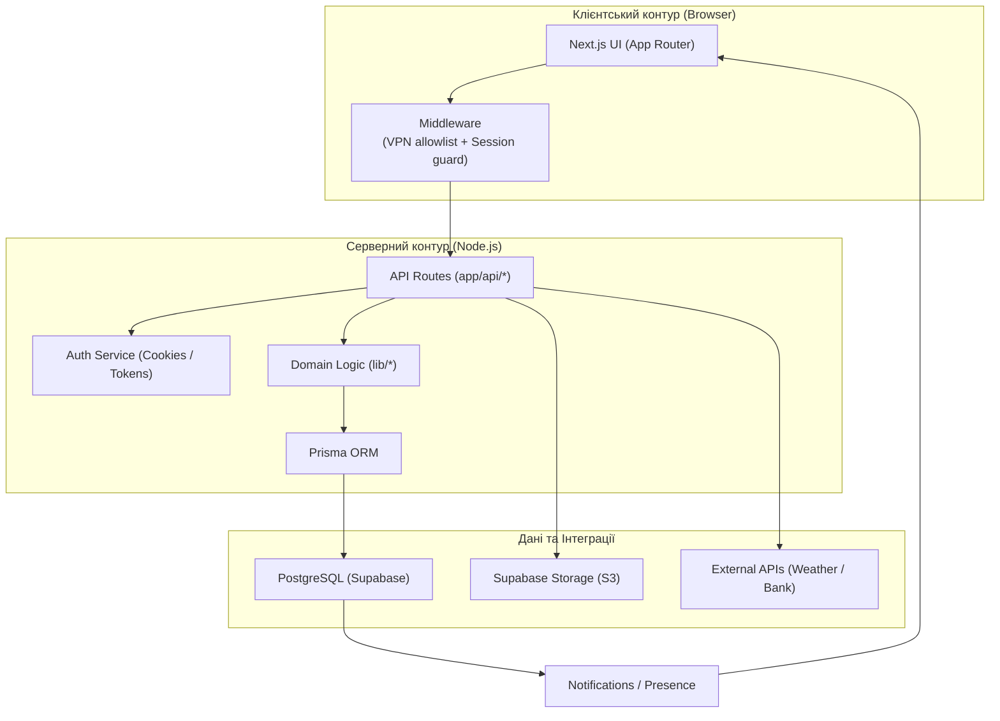
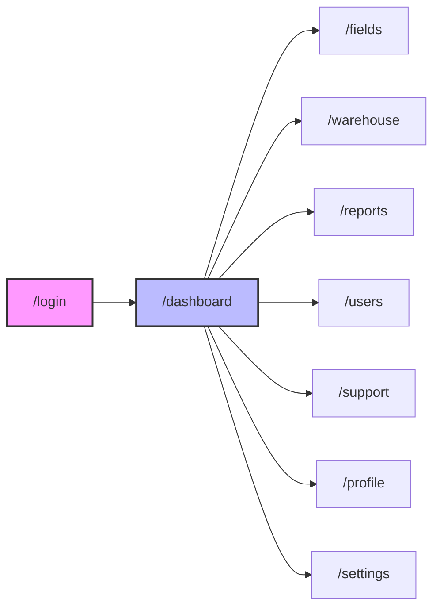
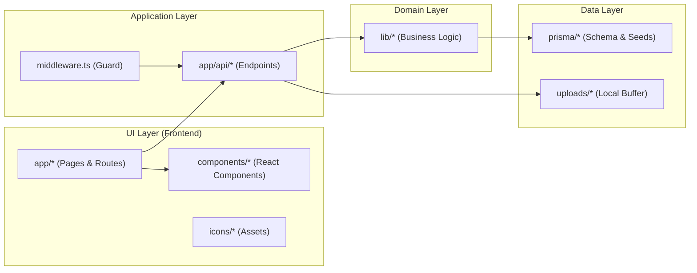

# AgroPlus Portal


**AgroPlus Portal** — це внутрішній операційний портал для агробізнесу. Тут реалізовано повний контур роботи підприємства: від моніторингу полів та складського обліку до керування технікою, звітами та підтримкою користувачів.

---

## 📑 Зміст

- [Візія проєкту](#-візія-проєкту)
- [Модулі системи](#-модулі-системи)
- [Архітектура](#-архітектура)
- [Потік завантаження звіту](#-потік-завантаження-звіту)
- [Карта сторінок](#-карта-сторінок)
- [Технологічний стек](#-технологічний-стек)
- [Мій локальний запуск](#-мій-локальний-запуск)
- [Мій процес міграцій і деплою](#-мій-процес-міграцій-і-деплою)
- [Доступ через OpenVPN](#-доступ-через-openvpn)
- [Структура проєкту](#-структура-проєкту)
- [Скрипти](#-скрипти)
- [Безпека](#-безпека)

---

## 🎯 Візія проєкту

Цей проєкт побудований як єдина екосистема для операційної команди агрохолдингу, що об'єднує розрізнені процеси в одному інтерфейсі.

- **Поля:** Інтерактивна карта, геометрія ділянок, сівозміна, статус робіт.
- **Склад:** Облік залишків, логування списань, історія руху ТМЦ.
- **Звіти:** Централізований upload `PDF/XLSX`, автопарсинг даних, прив'язка до відповідальних.
- **Користувачі:** RBAC (Role-Based Access Control), моніторинг активності, профілі.
- **Підтримка:** Внутрішня тікет-система з пріоритезацією та вкладеннями.
- **Сповіщення:** Система реакцій на критичні події (низький залишок на складі, нові звіти).

---

## 🧩 Модулі системи

| Модуль | Опис функціоналу | Ключові сутності БД |
|--------|------------------|---------------------|
| **Dashboard** | Оперативна панель: KPI, погода, статус палива, курси валют | `YieldForecast`, `Machinery`, `Notification` |
| **Fields** | Візуалізація земельного банку, кадастр, завдання агрономам | `Field`, `FieldTask` |
| **Warehouse** | Керування запасами ЗЗР, палива та посівного матеріалу | `InventoryItem`, `InventoryLog` |
| **Reports** | Сховище документації, аналітика файлів | `Report`, Supabase Storage |
| **Users** | Адміністрування персоналу, безпека доступу | `User` |
| **Support** | Helpdesk для співробітників | `SupportTicket`, `SupportAttachment` |
| **Profile** | Персоналізація та налаштування акаунту | `User.profileData`, `User.settingsData` |

---

## 🏗 Архітектура

Система побудована на базі сучасної Full-Stack архітектури Next.js із чітким розділенням на клієнтський та серверний рівні.



---

## 🔄 Потік завантаження звіту

Процес обробки файлів реалізований асинхронно з миттєвим сповіщенням користувача.

sequenceDiagram
  participant U as Користувач
  participant UI as Інтерфейс
  participant API as API Server
  participant DB as Local PostgreSQL
  participant FS as Local Disk

  U->>UI: Завантажує файл (PDF/XLSX)
  UI->>API: POST /api/reports/upload
  Note over API: Перевірка сесії (Auth)
  API->>FS: Збереження файлу в ./uploads
  FS-->>API: Шлях до файлу
  API->>DB: Запис метаданих (Назва, Розмір, Автор)
  DB-->>API: ID запису
  API-->>UI: 201 Created
  UI-->>U: Повідомлення "Збережено"

---

## 🗺 Карта сторінок



---

## 🛠 Технологічний стек

| Шар | Технології |
|-----|------------|
| **Frontend** | Next.js 15 (App Router), React 19, Tailwind CSS, Shadcn UI, MapLibre GL, Recharts |
| **Backend** | Next.js Route Handlers, Node.js |
| **Database & ORM** | PostgreSQL, Prisma ORM 6 |
| **Storage** | Supabase Storage |
| **Testing** | Vitest (Unit), Playwright (E2E) |
| **Utils** | Zod (Validation), date-fns, XLSX (Parser) |

---

## 🚀 Мій локальний запуск

Для розгортання проєкту локально я використовую наступний алгоритм:

### 1. Встановлення залежностей

```bash
pnpm install
```

### 2. Налаштування оточення

Створюю `.env` файл на основі прикладу:

```bash
cp .env.example .env
```

### 3. Конфігурація змінних

Заповнюю ключові параметри доступу до БД та сховища:
- `DATABASE_URL`
- `DIRECT_URL`
- `AUTH_SECRET`
- `SUPABASE_URL`
- `SUPABASE_SERVICE_ROLE_KEY`

### 4. Синхронізація бази даних

Заливаю схему Prisma у PostgreSQL:

```bash
pnpm db:push
```

### 5. Наповнення демо-даними

Запускаю сідер для створення адміна та тестових сутностей:

```bash
pnpm db:seed
```

### 6. Запуск сервера розробки

```bash
pnpm dev
```

---

## 📦 Мій процес міграцій і деплою

Я використовую суворий підхід до керування схемою бази даних:

1. Локально вношу зміни в `prisma/schema.prisma`
2. Створюю файл міграції: `pnpm prisma migrate dev`
3. Комічу папку `prisma/migrations/*` у репозиторій
4. На сервері застосовую міграції перед стартом

### Серверний цикл запуску (CI/CD)

```bash
pnpm install --frozen-lockfile
pnpm prisma migrate deploy
pnpm build
pnpm start
```

**Примітка щодо IPv6:** У продакшн середовищі `DIRECT_URL` часто працює через IPv6 пулери транзакцій Supabase, тому на сервері налаштовано підтримку обох протоколів.

---

## 🔐 Доступ через OpenVPN

Система спроєктована для роботи в ізольованому контурі. Я використовую два рівні захисту доступу:

1. **Інфраструктурний:** Доступ до сервера дозволено лише через OpenVPN тунель (Firewall/Security Groups)
2. **Прикладний:** Middleware перевіряє IP-адресу клієнта через змінну `VPN_ALLOWLIST`

### Конфігурація (`.env`)

```env
# Дозволені підмережі VPN та окремі адміністративні IP
VPN_ALLOWLIST="10.8.0.0/24,203.0.113.10/32"
```

---

## 📂 Структура проєкту

### Архітектурна карта



### Призначення директорій

```
.
├── app/                         # App Router: сторінки, layout, API
│   ├── api/                     # Backend endpoints
│   ├── dashboard/               # Головна панель (KPI)
│   ├── fields/                  # Модуль карти полів
│   ├── warehouse/               # Складський облік
│   ├── reports/                 # Звіти та завантаження
│   ├── users/                   # Керування персоналом
│   ├── support/                 # Тікет-система
│   └── settings/                # Налаштування системи
├── components/
│   ├── ui/                      # Базові UI-компоненти (Buttons, Inputs, Modals)
│   └── branding/                # Логотипи та стилі бренду
├── lib/                         # Бізнес-логіка, утиліти, авторизація
├── prisma/
│   ├── schema.prisma            # Опис структури БД
│   └── seed.ts                  # Скрипт початкового наповнення
├── scripts/                     # Допоміжні скрипти автоматизації
├── tests/                       # Тестування (Unit + E2E)
└── middleware.ts                # Захист маршрутів та VPN-фільтрація
```

---

## 📜 Скрипти

В `package.json` налаштовано команди для всіх етапів життєвого циклу:

- `pnpm dev` — Запуск локального сервера розробки
- `pnpm build` — Компіляція оптимізованого production білда
- `pnpm start` — Запуск готового білда
- `pnpm lint` — Перевірка коду лінтером
- `pnpm db:push` — Швидка синхронізація схеми (для dev)
- `pnpm db:seed` — Заповнення бази демо-даними
- `pnpm test` — Повний прогін усіх тестів (Unit + E2E)

---

## 🛡 Безпека

- **Environment Isolation:** Файл `.env` виключено з Git
- **Role Management:** `SUPABASE_SERVICE_ROLE_KEY` використовується виключно на серверній стороні для адміністративних дій
- **Rotation Policy:** У разі компрометації ключів виконується негайна ротація `AUTH_SECRET` та облікових даних БД

### 🔑 Демо-доступ (локально)

Для входу в систему після сідінгу використовуйте:

- **Логін:** `admin`
- **Пароль:** `admin123`

---

<div align="center">

**Розроблено з любов'ю до агротехнологій** 🌱

</div>
