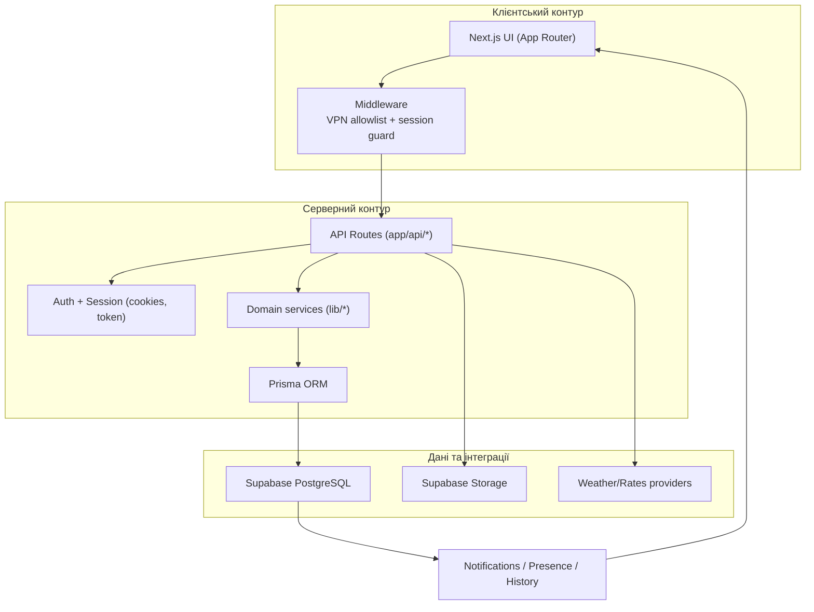
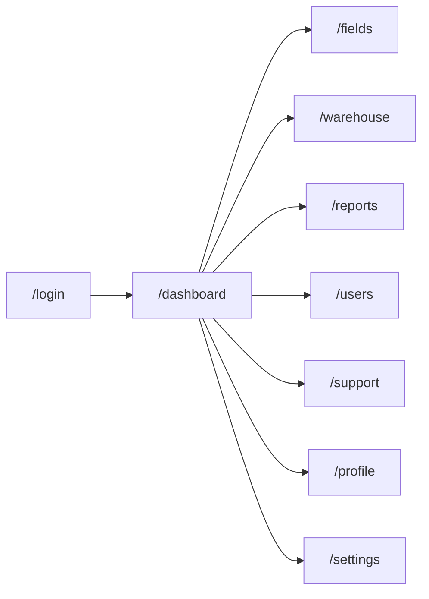
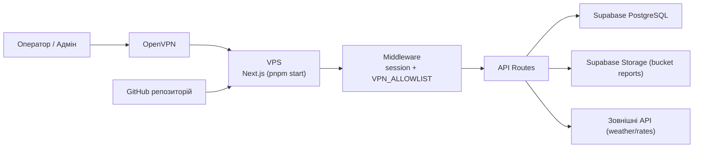

# AgroPlus Portal

Операційний веб-портал для агропідприємства: поля, склад, техніка, звіти, користувачі, підтримка та сповіщення в єдиній системі.

## Призначення

Проєкт закриває щоденні операційні сценарії команди:
- контроль стану полів і задач по них;
- контроль запасів і руху складу;
- завантаження та обробка звітів (`PDF`/`XLSX`);
- керування користувачами та доступами;
- внутрішня підтримка через тікети й вкладення;
- централізовані сповіщення про ключові події.

## Модулі системи

| Модуль | Що робить | Ключові дані |
|---|---|---|
| `Dashboard` | Оперативна панель з KPI, погодою, паливом, валютами, прогнозами | `YieldForecast`, `Machinery`, `Notification`, кеш погоди/курсів |
| `Fields` | Інтерактивна карта, додавання/редагування полів, задачі | `Field`, `FieldTask` |
| `Warehouse` | Облік позицій складу, списання, історія | `InventoryItem`, `InventoryLog` |
| `Reports` | Завантаження файлів, парсинг XLSX, привʼязка до користувача | `Report`, Supabase Storage |
| `Users` | Управління ролями, активністю, профілем | `User` |
| `Support` | Тікети, пріоритети, вкладення, статуси | `SupportTicket`, `SupportAttachment` |
| `Profile/Settings` | Персональні налаштування і робочі параметри | `User.profileData`, `User.settingsData` |

## Архітектура (система)



## Потік завантаження звіту


## Карта сторінок



## Технології

- `Next.js 15` (`App Router`)
- `React 19`
- `Prisma + PostgreSQL (Supabase)`
- `Supabase Storage`
- `Tailwind CSS`
- `MapLibre + Mapbox Draw`
- `Recharts`
- `Vitest` + `Playwright`

## Швидкий старт (локально)

1. Встановити залежності:
```bash
pnpm install
```

2. Створити `.env`:
```bash
cp .env.example .env
```

3. Заповнити змінні:
- `DATABASE_URL`
- `DIRECT_URL`
- `AUTH_SECRET`
- `SUPABASE_URL`
- `SUPABASE_SERVICE_ROLE_KEY`
- `SUPABASE_STORAGE_BUCKET`

4. Застосувати схему:
```bash
pnpm db:push
```

5. Опційно заповнити демо-дані:
```bash
pnpm db:seed
```

6. Запустити проєкт:
```bash
pnpm dev
```

## Міграції та деплой (сервер + Supabase)

Базовий робочий процес:

1. Локально розробляєте й створюєте міграцію (`prisma migrate dev`).
2. Комітите `prisma/migrations/*` у Git.
3. На сервері виконуєте лише `prisma migrate deploy` перед стартом застосунку.

Приклад:
```bash
pnpm install --frozen-lockfile
pnpm prisma migrate deploy
pnpm build
pnpm start
```

### Важливо для вашого кейсу з IPv4/IPv6

- `DIRECT_URL` може бути доступний лише через IPv6.
- Якщо сервер IPv4-only, запускайте міграції з вузла, де є IPv6-доступ (`Mac/CI runner/VPN-вузол`).
- Продакшн-сервер залишайте на `DATABASE_URL` (pooler), якщо він доступний з цього сервера.

## Схема деплою (OpenVPN + VPS + Supabase)



## Доступ тільки через VPN

У проєкті є middleware-перевірка `VPN_ALLOWLIST`.

Приклад:
```env
VPN_ALLOWLIST="10.8.0.0/24,203.0.113.10/32"
```

Рекомендація для production:
- залишити мережеве обмеження на рівні інфраструктури (`OpenVPN + firewall/security group`);
- `VPN_ALLOWLIST` тримати як додатковий захисний шар на рівні застосунку.

## Скрипти

- `pnpm dev` - розробка
- `pnpm build` - production build
- `pnpm start` - production server
- `pnpm lint` - ESLint перевірка
- `pnpm prisma` - Prisma CLI
- `pnpm db:push` - синхронізація схеми без міграцій (dev)
- `pnpm db:seed` - початкові дані
- `pnpm test:unit` - unit-тести
- `pnpm test:e2e` - e2e-тести
- `pnpm test` - повний прогін тестів

## Структура проєкту

```text
app/
  api/                  HTTP API (reports, fields, users, support, notifications...)
  dashboard/            Оперативна панель
  fields/               Інтерактивна карта полів
  warehouse/            Склад і облік руху
  reports/              Завантаження і перегляд звітів
  users/                Управління користувачами
  support/              Підтримка (тікети + вкладення)
  profile/ settings/    Профіль і налаштування
lib/
  auth*.ts              Авторизація та сесії
  db.ts                 Prisma client
  report-import.ts      Імпорт XLSX у доменні дані
  notifications.ts      Централізоване створення сповіщень
prisma/
  schema.prisma         Схема БД
  seed.ts               Сідер демо-даних
scripts/
  generate-sample-reports.js
tests/
  unit/ e2e/
```

## Безпека

- `.env` не комітити в Git.
- `SUPABASE_SERVICE_ROLE_KEY` використовувати тільки на сервері.
- Після підозри на витік - ротація всіх ключів (`DB password`, `service role key`, `AUTH_SECRET`).

## Демо-доступ (локальне середовище)

- Логін: `admin`
- Пароль: `admin123`
