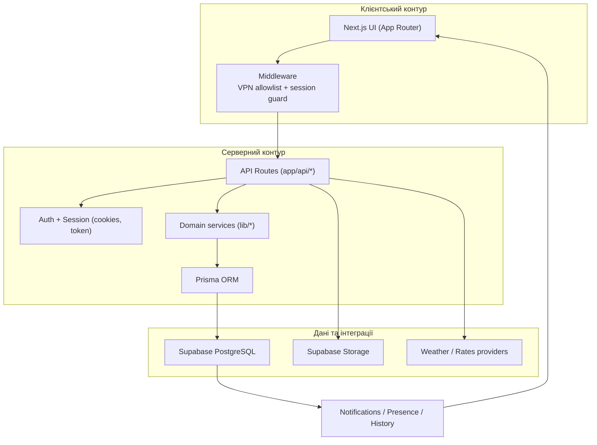
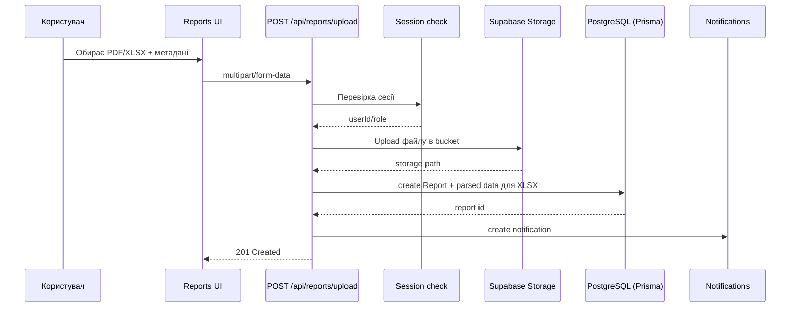
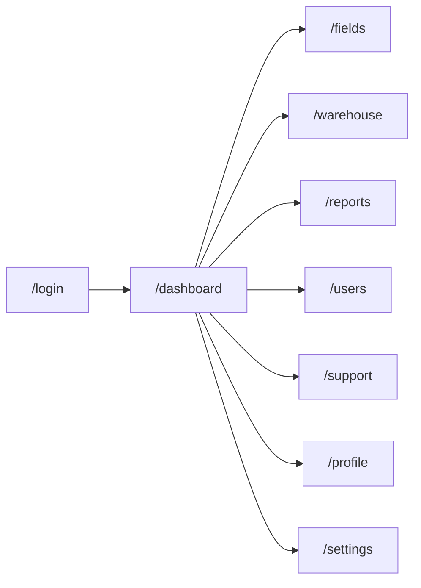
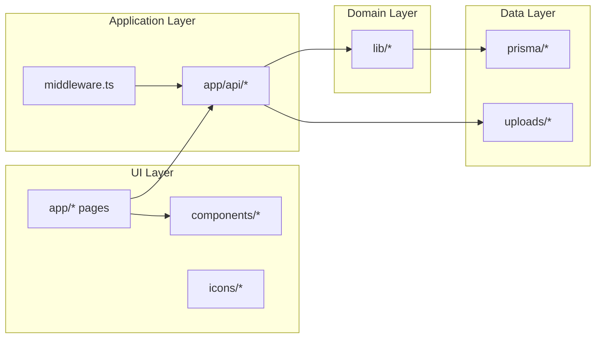

# AgroPlus Portal

> Мій внутрішній операційний портал для агробізнесу. Тут я зібрав повний контур роботи: поля, склад, техніку, звіти, користувачів, підтримку і сповіщення.

## Зміст

- [Візія проєкту](#візія-проєкту)
- [Модулі системи](#модулі-системи)
- [Архітектура](#архітектура)
- [Потік завантаження звіту](#потік-завантаження-звіту)
- [Карта сторінок](#карта-сторінок)
- [Технологічний стек](#технологічний-стек)
- [Мій локальний запуск](#мій-локальний-запуск)
- [Мій процес міграцій і деплою](#мій-процес-міграцій-і-деплою)
- [Доступ через OpenVPN](#доступ-через-openvpn)
- [Структура проєкту](#структура-проєкту)
- [Скрипти](#скрипти)
- [Безпека](#безпека)

## Візія проєкту

Цей проєкт я побудував як єдину робочу систему для операційної команди.

- Поля: карта, геометрія, задачі, статуси.
- Склад: облік, списання, історія руху.
- Звіти: upload `PDF/XLSX`, імпорт даних, прив'язка до користувача.
- Користувачі: ролі, активність, профіль і налаштування.
- Підтримка: тікети, пріоритети, вкладення.
- Сповіщення: системні події в реальному робочому потоці.

## Модулі системи

| Модуль | Як працює | Сутності |
|---|---|---|
| `Dashboard` | KPI, погода, паливо, курси, прогнози | `YieldForecast`, `Machinery`, `Notification` |
| `Fields` | Інтерактивна карта та задачі по полях | `Field`, `FieldTask` |
| `Warehouse` | Складські позиції, історія, списання | `InventoryItem`, `InventoryLog` |
| `Reports` | Завантаження, парсинг XLSX, зберігання файлів | `Report`, Supabase Storage |
| `Users` | Користувачі, ролі, активність | `User` |
| `Support` | Тікети, пріоритети, вкладення | `SupportTicket`, `SupportAttachment` |
| `Profile / Settings` | Персональні параметри користувача | `User.profileData`, `User.settingsData` |

## Архітектура



## Потік завантаження звіту



## Карта сторінок



## Технологічний стек

| Шар | Технології |
|---|---|
| UI | `Next.js 15`, `React 19`, `Tailwind CSS`, `MapLibre`, `Recharts` |
| Backend | `Next.js Route Handlers`, `Prisma` |
| Data | `Supabase PostgreSQL`, `Supabase Storage` |
| QA | `Vitest`, `Playwright` |

## Мій локальний запуск

Я використовую такий цикл:

1. Встановлюю залежності.
```bash
pnpm install
```

2. Створюю `.env` із шаблону.
```bash
cp .env.example .env
```

3. Заповнюю ключові змінні: `DATABASE_URL`, `DIRECT_URL`, `AUTH_SECRET`, `SUPABASE_URL`, `SUPABASE_SERVICE_ROLE_KEY`, `SUPABASE_STORAGE_BUCKET`.

4. Синхронізую схему з БД.
```bash
pnpm db:push
```

5. За потреби заливаю демо-дані.
```bash
pnpm db:seed
```

6. Підіймаю застосунок.
```bash
pnpm dev
```

## Мій процес міграцій і деплою

1. Локально вношу зміни в `prisma/schema.prisma`.
2. Створюю міграцію через `prisma migrate dev`.
3. Комічу `prisma/migrations/*` у GitHub разом із кодом.
4. На сервері виконую `prisma migrate deploy` перед запуском.

Серверний цикл:

```bash
pnpm install --frozen-lockfile
pnpm prisma migrate deploy
pnpm build
pnpm start
```

### IPv4 / IPv6 у моєму сценарії

- `DIRECT_URL` інколи доступний лише по IPv6.
- Якщо сервер IPv4-only, міграції я запускаю з вузла, де є IPv6.
- Runtime сервера тримаю на `DATABASE_URL` (pooler), якщо він доступний із сервера.

## Доступ через OpenVPN

У мережевому контурі я використовую два рівні захисту:

- інфраструктурний: `OpenVPN + firewall/security group`;
- прикладний: `VPN_ALLOWLIST` у middleware.

Приклад формату:

```env
VPN_ALLOWLIST="10.8.0.0/24,203.0.113.10/32"
```

## Структура проєкту

### Архітектурна карта директорій



### Дерево і роль кожної частини

```text
.
├── app/                         # сторінки, layout, route handlers
│   ├── api/                     # backend endpoints
│   ├── dashboard/               # оперативна панель
│   ├── fields/                  # карта полів і задачі
│   ├── warehouse/               # склад і рух залишків
│   ├── reports/                 # звіти і upload UI
│   ├── users/                   # користувачі та ролі
│   ├── support/                 # тікети підтримки
│   ├── profile/                 # профіль
│   └── settings/                # налаштування
├── components/
│   ├── ui/                      # універсальні UI-компоненти
│   └── branding/                # бренд-елементи
├── icons/                       # іконки проєкту
├── lib/                         # доменна логіка, auth, db, утиліти
├── prisma/
│   ├── schema.prisma            # модель даних
│   └── seed.ts                  # стартові дані
├── scripts/                     # технічні скрипти (наприклад, генерація звітів)
├── tests/
│   ├── unit/                    # unit тести
│   └── e2e/                     # end-to-end тести
├── uploads/                     # локальні завантаження/тестові файли
├── middleware.ts                # контроль доступу (session + VPN allowlist)
└── README.md                    # документація проєкту
```

### Де я додаю новий функціонал

| Що додаю | Куди додаю |
|---|---|
| Нова сторінка | `app/<feature>/page.tsx` |
| Новий API endpoint | `app/api/<feature>/route.ts` |
| Нова бізнес-логіка | `lib/<feature>.ts` |
| Нова таблиця / зв’язок | `prisma/schema.prisma` + міграція |
| Нові UI-примітиви | `components/ui/*` |
| Новий e2e сценарій | `tests/e2e/*` |
| Новий unit-тест | `tests/unit/*` |

## Скрипти

- `pnpm dev` - локальна розробка
- `pnpm build` - production build
- `pnpm start` - запуск production
- `pnpm lint` - перевірка ESLint
- `pnpm prisma` - Prisma CLI
- `pnpm db:push` - синхронізація схеми без міграцій
- `pnpm db:seed` - початкові демо-дані
- `pnpm test:unit` - unit-тести
- `pnpm test:e2e` - e2e-тести
- `pnpm test` - повний прогін тестів

## Безпека

- `.env` не потрапляє в Git.
- `SUPABASE_SERVICE_ROLE_KEY` використовую тільки на серверній стороні.
- Після підозри на витік одразу роблю ротацію: `DB password`, `service role key`, `AUTH_SECRET`.

## Демо-доступ (локально)

- Логін: `admin`
- Пароль: `admin123`
